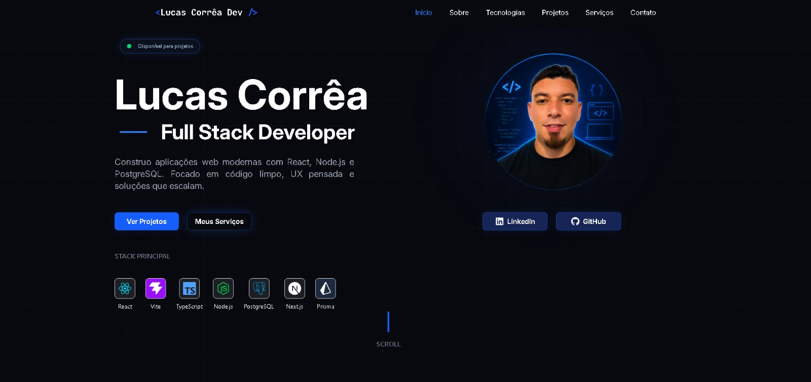
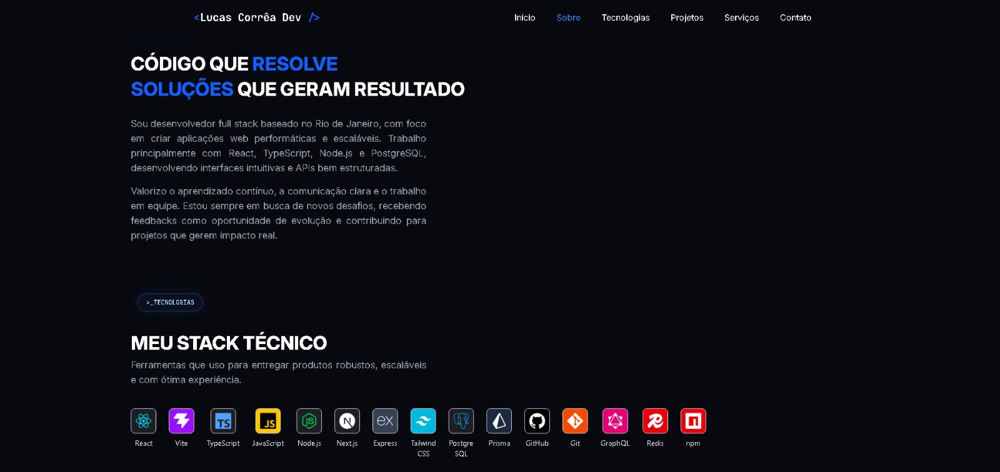
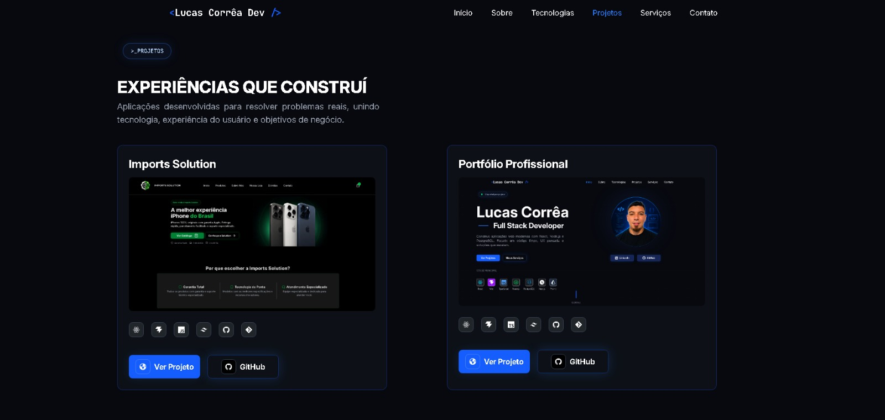
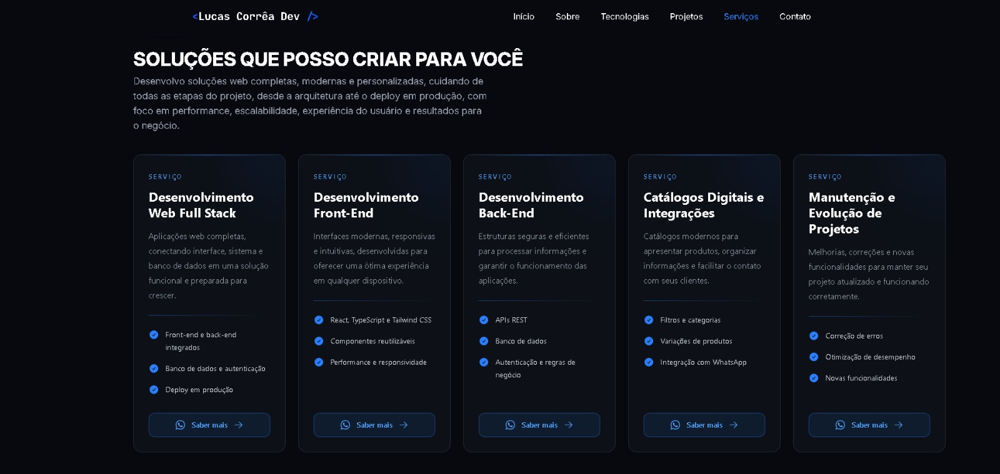

# 💻 Portfólio Profissional - Lucas Correa

Portfólio profissional desenvolvido para apresentar meus projetos, habilidades, serviços e trajetória como Desenvolvedor Full Stack.


---

# Sobre o projeto

Este projeto é o meu portfólio profissional, desenvolvido com o objetivo de apresentar minhas habilidades, experiências, projetos e serviços na área de desenvolvimento de software.

O portfólio funciona como uma central de apresentação profissional, permitindo que recrutadores, empresas e potenciais clientes conheçam meu trabalho, minhas principais tecnologias e as soluções que posso desenvolver.

A interface foi construída com foco em responsividade, organização, performance e experiência do usuário, utilizando uma identidade visual moderna e relacionada ao universo da tecnologia.

O principal objetivo do projeto é aumentar minha presença profissional na internet e contribuir para a conquista de oportunidades como Desenvolvedor Full Stack, além de facilitar o contato com possíveis clientes para projetos freelance.

Link do projeto: `ADICIONE_AQUI_O_LINK_DO_PROJETO`

---

# Funcionalidades

* Apresentação profissional do desenvolvedor
* Seção inicial com resumo profissional
* Apresentação das principais tecnologias
* Listagem de projetos desenvolvidos
* Cards com descrição, tecnologias e links dos projetos
* Seção de serviços oferecidos
* Links para GitHub e LinkedIn
* Navegação entre as seções da página
* Menu responsivo para dispositivos móveis
* Destaque automático da seção ativa no menu
* Integração com WhatsApp
* Design moderno e responsivo
* Estrutura preparada para receber novos projetos e funcionalidades

---

# ⚙ Tecnologias utilizadas

* React
* TypeScript
* Tailwind CSS
* Vite
* React Icons
* Git
* GitHub

---

# Preview do projeto

## Página inicial

<p align="center">
  
</p>

---

## Seção sobre

<p align="center">
  
</p>

---

## Projetos

<p align="center">
  
</p>

---

## Serviços

<p align="center">
  
</p>

---

# Responsividade

O projeto foi desenvolvido para funcionar corretamente em celulares, tablets, notebooks e monitores maiores.

<p align="center">
  

  

  
</p>

---

# Objetivo do projeto

O principal objetivo deste portfólio é apresentar de forma profissional minhas habilidades como Desenvolvedor Full Stack e reunir meus principais projetos em um único lugar.

O projeto busca facilitar o acesso de recrutadores, empresas e clientes às informações sobre minha experiência, tecnologias, serviços e formas de contato.

Além de apresentar meus conhecimentos técnicos, o portfólio também demonstra minha capacidade de construir interfaces modernas, responsivas, organizadas e focadas na experiência do usuário.

---

# Principais seções

## Início

Apresentação inicial com nome, área de atuação, resumo profissional, tecnologias principais e links para projetos e redes profissionais.

## Sobre

Seção destinada à apresentação da minha trajetória, objetivos profissionais, experiências e características pessoais.

## Tecnologias

Apresentação das principais tecnologias, ferramentas e conhecimentos utilizados durante o desenvolvimento dos meus projetos.

## Projetos

Exibição dos principais projetos desenvolvidos, contendo imagem, descrição, tecnologias utilizadas, link da aplicação e repositório no GitHub.

## Serviços

Apresentação das soluções que posso desenvolver, como sites institucionais, sistemas web, catálogos digitais, integrações e manutenção de projetos.

## Contato

Área destinada a facilitar o contato através do WhatsApp, LinkedIn, GitHub e outras plataformas profissionais.

---

# Melhorias futuras

* Adicionar novos projetos
* Criar uma página individual para cada projeto
* Adicionar formulário de contato
* Implementar envio de mensagens por e-mail
* Adicionar animações entre as seções
* Melhorar a acessibilidade
* Adicionar suporte para tema claro e escuro
* Criar uma área de artigos e conteúdos
* Adicionar certificados e experiências profissionais
* Implementar versão em inglês
* Melhorar SEO e compartilhamento nas redes sociais
* Adicionar métricas de acesso ao portfólio

---

# Status do projeto

Projeto em desenvolvimento.

Novas melhorias, projetos e funcionalidades estão sendo adicionados progressivamente.

---


# Estrutura do projeto

```text
src/
├── assets/
├── components/
├── layouts/
├── pages/
├── sections/
│   ├── About/
│   ├── Contact/
│   ├── Hero/
│   ├── Projects/
│   ├── Services/
│   └── Tech/
├── App.tsx
├── index.css
└── main.tsx
```

---

# 👨‍💻 Autor

Desenvolvido por **Lucas Correa**.

* GitHub: `ADICIONE_AQUI_SEU_GITHUB`
* LinkedIn: `ADICIONE_AQUI_SEU_LINKEDIN`
* Portfólio: `ADICIONE_AQUI_O_LINK_DO_PORTFOLIO`
